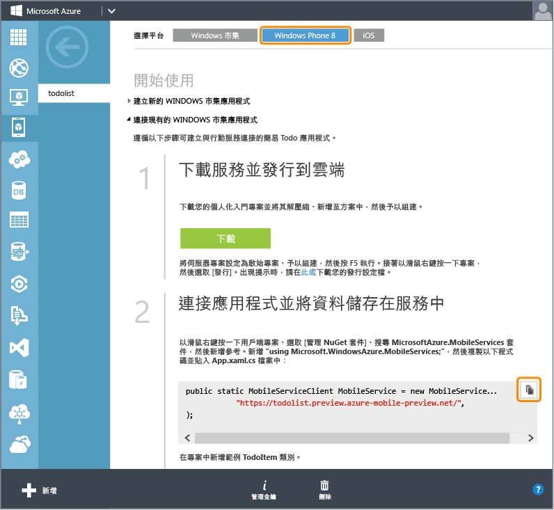
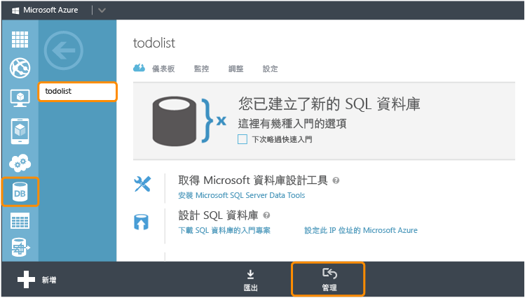

<properties 
	pageTitle="在現有的應用程式中加入行動服務 (Windows Phone) | 行動開發人員中心" 
	description="了解如何開始使用行動服務，在您的 Windows Phone 應用程式中使用資料。" 
	services="mobile-services" 
	documentationCenter="windows" 
	authors="wesmc7777" 
	manager="dwrede" 
	editor=""/>

<tags 
	ms.service="mobile-services" 
	ms.workload="mobile" 
	ms.tgt_pltfrm="mobile-windows-phone" 
	ms.devlang="dotnet" 
	ms.topic="article" 
	ms.date="05/12/2015" 
	ms.author="wesmc"/>

# 將行動服務新增至現有的應用程式

##概觀

[AZURE.INCLUDE [mobile-services-selector-get-started-data-legacy](../../includes/mobile-services-selector-get-started-data-legacy.md)]

本主題說明如何將 Azure 行動服務新增為 Windows Phone 8.1 Silverlight 應用程式的後端資料來源。在本教學課程中，您將下載 Visual Studio 專案，以取得將資料儲存在記憶體中的應用程式、建立新的行動服務、整合行動服務與該應用程式，然後檢視執行應用程式時所做的資料變更。若要將行動服務加入至 Windows Phone 市集 8.1 應用程式，請參閱[這個版本的教學課程](mobile-services-dotnet-backend-windows-universal-dotnet-get-started-data.md)。

您將在本教學課程中建立的行動服務，將可在行動服務中支援 .NET 執行階段。如此，您即可在行動服務中使用 .NET 語言和 Visual Studio 來撰寫伺服器端商務邏輯。若要建立可讓您以 JavaScript 撰寫伺服器端商務邏輯的行動服務，請參閱本主題的 [JavaScript 後端版本](mobile-services-windows-phone-get-started-data.md)。

##必要條件

本教學課程需要下列各項：

+ Visual Studio 2013 Update 2 或更新版本。
+ Microsoft Azure 帳戶。如果您沒有帳戶，只需要幾分鐘的時間就可以建立免費試用帳戶。如需詳細資料，請參閱 <a href="http://azure.microsoft.com/pricing/free-trial/?WT.mc_id=AE564AB28&amp;returnurl=http%3A%2F%2Fazure.microsoft.com%2Fzh-tw%2Fdocumentation%2Farticles%2Fmobile-services-dotnet-backend-windows-store-dotnet-get-started-data%2F" target="_blank">Azure 免費試用</a>。 

##下載 GetStartedWithData 專案

本教學課程以 [GetStartedWithMobileServices 應用程式](https://code.msdn.microsoft.com/Add-Azure-Mobile-to-a-8b906f72)，亦即以 Visual Studio 2013 的 Windows Phone Silverlight 8.1 應用程式專案為建立基礎。

1. 從[開發人員程式碼範例網站](https://code.msdn.microsoft.com/Add-Azure-Mobile-to-a-8b906f72)中下載 C# 版本的 GetStartedWithMobileServices 範例應用程式。 

	>[AZURE.NOTE]若要建立 Windows Phone Silverlght 8.1 應用程式，只要將已下載之 Windows Phone Silverlight 8 應用程式專案的目標 OS 變更為 Windows Phone 8.1 即可。若要建立 Windows Phone 市集應用程式，請下載 GetStartedWithData 範例應用程式專案的 [Windows Phone 市集應用程式版本](http://go.microsoft.com/fwlink/p/?LinkId=397372)。

2. 以滑鼠右鍵按一下 Visual Studio，然後按一下 [以系統管理員身分執行]，以系統管理權限來執行 Visual Studio。

3. 在 Visual Studio 中，開啟下載的專案並檢查 MainPage.xaml.cs 檔案。

   	請注意，新增的 **TodoItem** 物件儲存在記憶體內部 **ObservableCollection&lt;TodoItem&gt;** 中。

4. 在 Visual Studio 中，選擇應用程式的部署目標。您可以部署至 Windows Phone 裝置，或是 Windows Phone SDK 隨附的其中一個模擬器。在本教學課程中，我們將示範如何部署至模擬器。

5. 按 [F5] 鍵。這會建置、部署及啟動用於偵錯的應用程式。

6. 在此應用程式的文字方塊中輸入文字，然後按一下 [儲存]，以將若干項目儲存在應用程式的記憶體內部。

   	

   	請注意每個 `TodoItem` 的文字會顯示在重新整理按鈕下方，並附有核取方塊，可讓您將該項目標示為已完成。

##建立新的行動服務

[AZURE.INCLUDE [mobile-services-dotnet-backend-create-new-service](../../includes/mobile-services-dotnet-backend-create-new-service.md)]

##下載行動服務專案並將其新增至方案

1. 下載並安裝 [Visual Studio Professional 2013](https://go.microsoft.com/fwLink/p/?LinkID=391934) 或更新版本 (若您尚未這麼做)。
 
2. 在 [Azure 管理入口網站](https://manage.windowsazure.com/)中，按一下新的行動服務，在快速入門頁面按一下 [**Windows**] 平台，然後在 [**開始使用**] 下展開 [**連接現有的 Windows 或 Windows Phone 應用程式**]。

    

4. 在 [**下載您的服務並發佈至雲端**] 下，按一下 [**下載**]。

	這會下載實作行動服務的 Visual Studio 專案。

4. 將您下載的個人化服務入門方案解壓縮，然後 zip 檔案中的資料夾，複製到「開始使用資料」方案檔案 (.sln) 所在的相同 **C#** 目錄中。這樣可讓 NuGet Package Manager 易於將所有的封裝保持同步。

5. 在 Visual Studio 的 [方案總管] 中，以滑鼠右鍵按一下「開始使用資料」Windows 市集應用程式的方案。按一下 [新增]，然後按一下 [現有專案]。

6. 在 [**新增現有專案**] 對話方塊中，導覽至先前移入 **C#** 目錄中的行動服務專案資料夾，在服務子目錄中選取 C# 專案檔 (.csproj)，然後按一下 [**開啟**] 將專案加入至您的方案。

7. 在 Visual Studio 的 [方案總管] 中，以滑鼠右鍵按一下您剛剛新增的服務專案，然後按一下 [建置]，以驗證專案可順利建置而不會產生錯誤。在建置期間，NuGet 封裝管理員可能必須還原某些在專案中受到參考的 NuGet 封裝。

8. 再次以滑鼠右鍵按一下服務專案。這次，請在 [偵錯] 內容功能表下按一下 [Start new instance]。

    Visual Studio 會為您的服務開啟預設網頁。您可以按一下 [try it now]，以從行動服務中的預設網頁測試方法。

    

    Visual Studio 依預設使用 IIS Express 在本機代管您的行動服務。您可以在工作列上以滑鼠右鍵按一下 IIS Express 的系統匣圖示，以檢視此設定。

##更新 Windows Phone 應用程式以使用行動服務

在本節中，您將會更新 Windows Phone 應用程式，以使用行動服務作為應用程式的後端服務。

1. 在 Visual Studio 的 [方案總管] 中，以滑鼠右鍵按一下 Windows Phone 應用程式專案，然後按一下 [管理 NuGet 封裝]。

2. 在 [管理 NuGet 封裝] 對話方塊中，搜尋位於線上封裝集合中的 **WindowsAzure.MobileServices** 並加以點選，以安裝 Azure 行動服務 Nuget 封裝。然後關閉對話方塊。

    

3. 回到 Azure 管理入口網站，找出標示為「連接應用程式並將資料儲存在服務中」的步驟。複製用來建立 `MobileServiceClient` 連線的程式碼片段。

    

4. 在 Visual Studio 中，開啟 App.xaml.cs。將程式碼片段貼到 `App` 類別定義的開頭處。並且在檔案頂端新增下列 `using` 陳述式，然後儲存檔案。

		using Microsoft.WindowsAzure.MobileServices;

5. 在 Visual Studio 中開啟 MainPage.xaml.cs，然後將 using 陳述式新增至檔案頂端：

		using Microsoft.WindowsAzure.MobileServices;

6. 在 Visual Studio 中，將 MainPage.xaml.cs 中的 `MainPage` 類別定義替換為以下定義，並儲存檔案。

    此程式碼會使用行動服務 SDK，使應用程式能夠將其資料儲存在服務提供的資料表中，而不儲存在本機的記憶體內部。主要的三種方法為 `InsertTodoItem`、`RefreshTodoItems`和 `UpdateCheckedTodoItem`。這三種方法可讓您以非同步方式插入、查詢資料集合，以及將其更新至 Azure 中的資料表。

        public sealed partial class MainPage : PhoneApplicationPage
        {
            private MobileServiceCollection<TodoItem, TodoItem> items;
            private IMobileServiceTable<TodoItem> todoTable = 
                App.MobileService.GetTable<TodoItem>();            
            public MainPage()
            {
                this.InitializeComponent();
            }
            private async void InsertTodoItem(TodoItem todoItem)
            {
                await todoTable.InsertAsync(todoItem); 
                items.Add(todoItem);
            }
            private async void RefreshTodoItems()
            {
                items = await todoTable 
                    .ToCollectionAsync(); 
                ListItems.ItemsSource = items;
            }
            private async void UpdateCheckedTodoItem(TodoItem item)
            {
                await todoTable.UpdateAsync(item);      
            }
            private void ButtonRefresh_Click(object sender, RoutedEventArgs e)
            {
                RefreshTodoItems();
            }
            private void ButtonSave_Click(object sender, RoutedEventArgs e)
            {
                var todoItem = new TodoItem { Text = InputText.Text };
                InsertTodoItem(todoItem);
            }
            private void CheckBoxComplete_Checked(object sender, RoutedEventArgs e)
            {
                CheckBox cb = (CheckBox)sender;
                TodoItem item = cb.DataContext as TodoItem;
                item.Complete = (bool)cb.IsChecked;
                UpdateCheckedTodoItem(item);
            }
            protected override void OnNavigatedTo(NavigationEventArgs e)
            {
                RefreshTodoItems();
            }
        }

##以本機代管的服務測試 Windows Phone 應用程式</h2>

在本節中，您將使用 Visual Studio 在本機的開發工作站中測試應用程式和行動服務。為了能夠從 Windows Phone 裝置或其中一個 Windows Phone 模擬器測試 IIS Express 本機代管的行動服務，您必須設定 IIS Express 和工作站，以允許連接到工作站的 IP 位址和連接埠。Windows Phone 裝置和模擬器會以非本機網路用戶端的形式連接。

#### 設定 IIS Express 以允許遠端連線

[AZURE.INCLUDE [mobile-services-how-to-configure-iis-express](../../includes/mobile-services-how-to-configure-iis-express.md)]

#### 對 IIS Express 中的行動服務測試應用程式

6. 在 Visual Studio 中開啟 App.xaml.cs 檔案，然後將您最近貼在檔案中的 `MobileService` 定義註解化。新增新的定義，以根據您在工作站上設定的 IP 位址和連接埠建立連線。接著，請儲存檔案。程式碼應會如下所示：

        public static MobileServiceClient MobileService = new MobileServiceClient(
            "http://192.168.111.11:54321");

        //public static MobileServiceClient MobileService = new MobileServiceClient(
        //    "https://todolist.azure-mobile.net/",
        //    "XXXXXXXXXXXXXXXXXXXXXXXXXXXXXXXX"
        //);        

7. 在 Visual Studio 中按 F7 鍵，或從 [建置] 功能表中按一下 [建置方案]，以建置 Windows Phone 應用程式和行動服務。請在 Visual Studio 的輸出視窗中，驗證兩個專案都順利建置而未產生錯誤。

8. 在 Visual Studio 中按 F5 鍵，或從 [偵錯] 功能表中按一下 [開始偵錯]，以執行應用程式，並在 IIS Express 中本機代管行動服務。

    >[AZURE.NOTE]請確實使用 [以系統管理員身分執行] 選項執行 Visual Studio。否則，IIS Express 可能無法載入您的 applicationhost.config 變更。

9. 輸入新 todoitem 的文字。然後按一下 [儲存]。這會在 IIS Express 本機代管的行動服務所建立的資料庫中，插入新的 todoItem。按一下其中一個項目的核取方塊，將其標示為已完成。

10. 在 Visual Studio 中，停止對應用程式的偵錯。您可以開啟 [伺服器總管] 並展開 [資料連線]，以檢視您為後端服務建立之資料庫中的變更。以滑鼠右鍵按一下 [MS_TableConnectionString] 下的 TodoItems 資料表，然後按一下 [顯示資料表資料]。

    

11. 當本機代管的行動服務完成測試後，請刪除您先前建立以開啟工作站連接埠的 Windows 防火牆規則。

##將行動服務發佈至 Azure

[AZURE.INCLUDE [mobile-services-dotnet-backend-publish-service](../../includes/mobile-services-dotnet-backend-publish-service.md)]

##測試發佈至 Azure 的行動服務

1. 在 Visual Studio 中，開啟 App.xaml.cs。將建立 `MobileServiceClient` (連接到本機代管的行動服務) 的程式碼註解化。將建立 `MobileServiceClient` (連接到 Azure 中的服務) 的程式碼取消註解。儲存檔案的變更。

        sealed partial class App : Application
        {
            //public static MobileServiceClient MobileService = new MobileServiceClient(
            //          "http://192.168.111.11:54321");

            // Use this constructor instead after publishing to the cloud
            public static MobileServiceClient MobileService = new MobileServiceClient(
                 "https://todolist.azure-mobile.net/",
                 "XXXXXXXXXXXXXXXXXXXXXXXXXXXXXXXX"
            );        
            ....

2. 在 Visual Studio 中按 F5 鍵，或從 [偵錯] 功能表中按一下 [開始偵錯]。這會使應用程式以先前的變更重新建置，然後再執行應用程式，以連接到 Azure 遠端代管的行動服務。

3. 輸入新的 todoitem，然後為每個項目按一下 [儲存]。按一下核取方塊，以完成部分的新項目。每個新的 todoItem，都會儲存在您先前在 Azure 管理入口網站中為行動服務設定的 SQL Database 中，並進行更新。

    您可以重新啟動應用程式，以確認變更持續存留至 Azure 中的資料庫。您也可以使用 Azure 管理入口網站或 Visual Studio 的 SQL Server 物件總管來檢查資料庫。後續的兩個步驟將使用 Azure 管理入口網站檢視您資料庫中的變更。

4. 在 Azure 管理入口網站中，對您行動服務的相關資料庫按一下 [管理]。

    

5. 在管理入口網站中執行查詢，以檢視應用程式所做的變更。您的查詢會與下列查詢類似，但使用您的資料庫名稱，而非 `todolist`。

        SELECT * FROM [todolist].[todoitems]

    

這將結束**開始使用資料**教學課程。

##後續步驟

本教學課程將示範啟用 Windows Phone 8 應用程式，進而使用透過 .Net 執行階段而建置之行動服務資料的基本概念。接下來，請完成以下其中一項教學課程：

* [開始使用驗證]  了解如何驗證應用程式的使用者。

* [將推播通知新增至您的應用程式]()  了解如何將非常基本的推播通知傳送至應用程式。

* [行動服務 .NET 作法概念參考資料]  深入了解如何使用搭配 .NET 的行動服務。
  

<!-- Images. -->

<!-- URLs. -->
[Get started with Mobile Services]: ../mobile-services-dotnet-backend-windows-phone-get-started.md
[Get started with data]: mobile-services-dotnet-backend-windows-phone-get-started-data.md
[開始使用驗證]: mobile-services-dotnet-backend-windows-phone-get-started-users.md
[Get started with push notifications]: mobile-services-dotnet-backend-windows-phone-get-started-push.md

[Windows Phone 8 SDK]: http://go.microsoft.com/fwlink/p/?linkid=268374
[Azure Management Portal]: https://manage.windowsazure.com/
[Management Portal]: https://manage.windowsazure.com/
[Mobile Services SDK]: http://go.microsoft.com/fwlink/p/?LinkId=257545
[Developer Code Samples site]: https://code.msdn.microsoft.com/Add-Azure-Mobile-to-a-8b906f72
[行動服務 .NET 作法概念參考資料]: mobile-services-windows-dotnet-how-to-use-client-library.md
[MobileServiceClient class]: http://go.microsoft.com/fwlink/p/?LinkId=302030
[How to add a new Windows Firewall port rule]: http://go.microsoft.com/fwlink/?LinkId=392240
   

<!---HONumber=July15_HO2-->