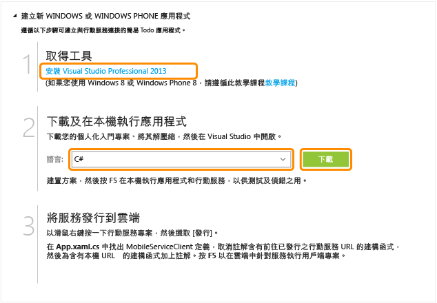

<properties
	pageTitle="開始使用 Windows Universal 應用程式的行動服務 | 行動開發人員中心"
	description="遵循此教學課程，可開始使用 Azure 行動服務以 C# 進行通用 Windows 應用程式開發。"
	services="mobile-services"
	documentationCenter="windows"
	authors="ggailey777"
	manager="dwrede"
	editor=""/>

<tags
	ms.service="mobile-services"
	ms.workload="mobile"
	ms.tgt_pltfrm="mobile-windows"
	ms.devlang="dotnet"
	ms.topic="article" 
	ms.date="05/03/2015"
	ms.author="glenga"/>

# 開始使用行動服務

[AZURE.INCLUDE [mobile-services-selector-get-started](../../includes/mobile-services-selector-get-started.md)]

本教學課程顯示如何使用 Azure 行動服務，將雲端型後端服務新增到通用 Windows 應用程式。通用 Windows 應用程式解決方案包括 Windows 市集 8.1 和 Windows Phone 市集 8.1 應用程式的專案，以及一般共用專案。如需詳細資訊，請參閱[建置目標為 Windows 和 Windows Phone 的通用 Windows 應用程式](http://msdn.microsoft.com/library/windows/apps/xaml/dn609832.aspx)。

在本教學課程中，您將建立新的行動服務，並建立可在新的行動服務中儲存應用程式資料的簡單*待辦事項*應用程式。您所將建立的行動服務，會使用 Visual Studio 與支援的 .NET 語言撰寫伺服器端商務邏輯，並管理行動服務。若要建立可讓您以 JavaScript 撰寫伺服器端商務邏輯的行動服務，請參閱本主題的 JavaScript 後端版本。

>[AZURE.NOTE]本主題將說明如何使用 Azure 管理入口網站建立新的行動服務專案和通用 Windows 應用程式。使用 Visual Studio 2013 Update 3，可讓您將新的行動服務專案新增至現有的 Visual Studio 方案。如需詳細資訊，請參閱[將行動服務新增至現有的應用程式](mobile-services-dotnet-backend-windows-universal-dotnet-get-started-data.md)。

>若要將行動服務新增至 Windows Phone 8.0 或 Windows Phone Silverlight 8.1 應用程式專案，請參閱[將行動服務新增至現有的 Windows Phone 應用程式](mobile-services-dotnet-backend-windows-phone-get-started-data.md)。

[AZURE.INCLUDE [mobile-services-windows-universal-get-started](../../includes/mobile-services-windows-universal-get-started.md)]

若要完成此教學課程，您需要下列項目：

* 使用中的 Azure 帳戶。如果您沒有帳戶，您可以註冊 Azure 試用版並取得高達 10 項的免費行動服務。此外，在試用期間結束後您仍可繼續使用這些服務。如需詳細資訊，請參閱 [Azure 免費試用](http://azure.microsoft.com/pricing/free-trial/?WT.mc_id=A0E0E5C02&amp;returnurl=http%3A%2F%2Fazure.microsoft.com%2Fzh-tw%2Fdocumentation%2Farticles%2Fmobile-services-dotnet-backend-windows-store-dotnet-get-started%2F)。
* [Visual Studio 2013]。

## 建立新的行動服務

[AZURE.INCLUDE [mobile-services-dotnet-backend-create-new-service](../../includes/mobile-services-dotnet-backend-create-new-service.md)]

## 建立新的通用 Windows 應用程式

在建立您的行動服務之後，您可以依照 [管理入口網站] 中的簡易快速入門，來建立新的應用程式或修改現有的應用程式，以連接到您的行動服務。

在本節中，您將建立與行動服務連線的新通用 Windows 應用程式。

1. 在管理入口網站中，按一下 **[行動服務]**，然後按一下您剛剛建立的行動服務。

2. 在快速入門索引標籤中，按一下 [Choose platform] 下的 [Windows]，並展開 [Create a new Windows Store app]。

   	這將顯示三個簡單步驟，可用來建立連接到您行動服務的 Windows 市集應用程式。

  	

3. 在您的本機電腦或虛擬機器下載並安裝 [Visual Studio 2013] (如果您尚未這麼做)。

4. 在 [Download and run your app and service locally] 中，選取 Windows 市集應用程式的語言，然後按一下 [下載]。

  	這會下載一個方案，其中包含行動服務的專案，以及與行動服務連接的範例_待辦事項_應用程式的專案。將此壓縮專案檔案儲存到您的本機電腦，並記錄儲存位置。

## 對本機行動服務進行應用程式測試

[AZURE.INCLUDE [mobile-services-dotnet-backend-test-local-service-dotnet](../../includes/mobile-services-dotnet-backend-test-local-service-dotnet.md)]

>[AZURE.NOTE]您可以檢閱存取行動服務來查詢和插入資料的程式碼，這可以在 MainPage.xaml.cs 檔案中找到。

## 發佈行動服務

[AZURE.INCLUDE [mobile-services-dotnet-backend-publish-service](../../includes/mobile-services-dotnet-backend-publish-service.md)]

<ol start="4">
<li>
在共用程式碼專案中，開啟 App.xaml.cs 檔案，找出建立 <a href="http://msdn.microsoft.com/library/Windowsazure/microsoft.windowsazure.mobileservices.mobileserviceclient.aspx" target="_blank">MobileServiceClient</a> 執行個體的程式碼，使用 <em>localhost</em> 將建立此用戶端的程式碼註解化，然後使用遠端行動服務 URL，將建立用戶端的程式碼取消註解，如下所示：

        <pre><code>public static MobileServiceClient MobileService = new MobileServiceClient(
            "https://todolist.azure-mobile.net/",
            "XXXX-APPLICATION-KEY-XXXXX");</code></pre>

	
此時，用戶端會存取發佈至 Azure 的行動服務。
</li>
</ol>

## 對 Azure 中代管的行動服務測試應用程式

現在行動服務已發佈，且用戶端已連接至 Azure 代管的遠端行動服務，我們就可以使用 Azure 來執行應用程式，以儲存項目。

[AZURE.INCLUDE [mobile-services-windows-universal-test-app](../../includes/mobile-services-windows-universal-test-app.md)]

## 後續步驟
請注意，您已完成快速入門，並了解如何執行行動服務中的其他重要工作：

* [將行動服務新增至現有的應用程式][Get started with data]  深入了解使用行動服務來儲存與查詢資料。

* [開始使用離線資料同步]  了解如何使用離線資料同步，讓您的應用程式更穩健及具備回應力。

* [將驗證新增至行動服務應用程式][Get started with authentication]  了解如何向身分識別提供者驗證應用程式的使用者。

* [將推播通知新增至您的應用程式][Get started with push notifications]  了解如何將非常基本的推播通知傳送至應用程式。

* [行動服務 .NET 後端疑難排解]  了解如何診斷及修復行動服務 .NET 後端可能發生的問題。

如需通用 Windows 應用程式的詳細資訊，請參閱[從單一行動服務支援多個裝置平台](mobile-services-how-to-use-multiple-clients-single-service.md#shared-vs) (英文)。

<!-- Anchors. -->

<!-- Images. -->

<!-- URLs. -->
[Visual Studio 2013]: https://go.microsoft.com/fwLink/p/?LinkID=257546
[Get started with data]: mobile-services-dotnet-backend-windows-universal-dotnet-get-started-data.md
[Get started with data]: ../mobile-services-dotnet-backend-windows-store-dotnet-get-started-data.md
[開始使用離線資料同步]: mobile-services-windows-store-dotnet-get-started-offline-data.md
[Get started with authentication]: ../mobile-services-dotnet-backend-windows-store-dotnet-get-started-users.md
[Get started with push notifications]: ../mobile-services-dotnet-backend-windows-store-dotnet-get-started-push.md
[Visual Studio Professional 2013]: https://go.microsoft.com/fwLink/p/?LinkID=257546
[Mobile Services SDK]: http://go.microsoft.com/fwlink/?LinkId=257545
[JavaScript and HTML]: mobile-services-win8-javascript/
[Management Portal]: https://manage.windowsazure.com/
[JavaScript backend version]: ../mobile-services-windows-store-get-started.md
[Get started with data in Mobile Services using Visual Studio 2012]: ../mobile-services-windows-store-dotnet-get-started-data-vs2012.md
[行動服務 .NET 後端疑難排解]: mobile-services-dotnet-backend-how-to-troubleshoot.md
 

<!---HONumber=July15_HO2-->