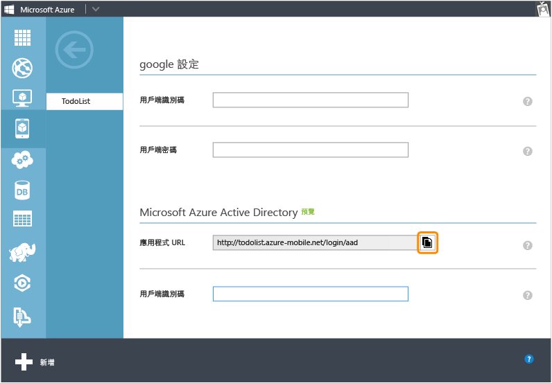
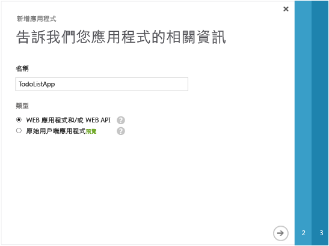
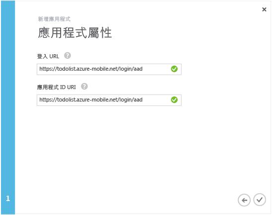
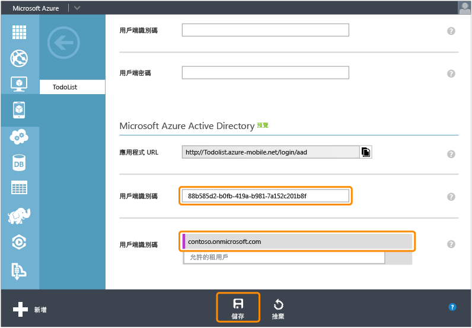

<properties 
	pageTitle="註冊 Azure Active Directory 驗證 |Azure 行動服務" 
	description="了解如何在 Mobile Services 應用程式中註冊 Azure Active Directory 驗證。" 
	authors="wesmc7777" 
	services="mobile-services" 
	documentationCenter="" 
	manager="dwrede" 
	editor=""/>

<tags 
	ms.service="mobile-services" 
	ms.workload="mobile" 
	ms.tgt_pltfrm="multiple" 
	ms.devlang="multiple" 
	ms.topic="article" 
	ms.date="06/15/2015" 
	ms.author="wesmc"/>

# 註冊應用程式以使用 Azure Active Directory 帳戶登入

[AZURE.INCLUDE [mobile-services-selector-register-identity-provider](../../includes/mobile-services-selector-register-identity-provider.md)]

##概觀

本主題說明如何註冊應用程式，以使用 Azure Active Directory 作為行動服務的驗證提供者。

##註冊您的應用程式

>[AZURE.NOTE]當您想要對應用程式使用[服務主導登入作業](http://msdn.microsoft.com/library/azure/dn283952.aspx)時，即適合搭配使用本主題所述的步驟以及[將驗證加入至行動服務應用程式](../mobile-services-dotnet-backend-windows-store-dotnet-get-started-users.md)教學課程。或者，如果您的應用程式具有 Azure Active Directory 及 .NET 後端行動服務的[用戶端主導登入作業](http://msdn.microsoft.com/library/azure/jj710106.aspx)需求，則您應該從[使用 Active Directory Authentication Library 單一登入驗證您的應用程式](mobile-services-windows-store-dotnet-adal-sso-authentication.md)教學課程開始。

1. 登入 [Azure 管理入口網站]，瀏覽至您的行動服務，按一下 [**識別**] 索引標籤，然後向下捲動至 **Azure Active Directory** 身分識別提供者區段，然後複製顯示的**應用程式 URL**。

    

2. 在管理入口網站中瀏覽至 [**Active Directory**]，按一下您的目錄和 [**網域**]，並記下目錄的預設網域。

3. 按一下 [**應用程式**] > [**新增**] > [**加入我的組織正在開發的應用程式**]。

4. 在 [新增應用程式精靈] 中，輸入應用程式的 [**名稱**]，然後按一下 [**Web 應用程式和/或 Web API**] 類型。

    

5. 在 [**登入 URL**] 方塊中，貼上從行動服務複製的應用程式 URL 值。在 [**應用程式識別碼 URI**] 方塊中輸入相同的唯一值，然後按一下以繼續。
 
    

6. 加入應用程式之後，請按一下 [**設定**] 索引標籤，然後複製應用程式的 [**用戶端識別碼**]。

    >[AZURE.NOTE]對於 .NET 後端行動服務，您還必須將 [**單一登入**] 下方的 [**回覆 URL**] 值編輯為行動服務的 URL，並附加 _signin-aad_ 路徑。例如，`https://todolist.azure-mobile.net/signin-aad`

7. 返回行動服務的 [**識別**] 索引標籤，然後貼上複製的 Azure Active Directory 身分識別提供者 [**用戶端識別碼**] 值。
 
    

8.  在 [**允許的租用戶**] 清單中，輸入註冊應用程式之目錄的網域 (例如 `contoso.onmicrosoft.com`)，然後按一下 [**儲存**]。

現在，您已可在應用程式中使用 Azure Active Directory 進行驗證。

<!-- Anchors. -->

<!-- Images. -->

<!-- URLs. -->
[Azure 管理入口網站]: https://manage.windowsazure.com/

 

<!---HONumber=July15_HO1-->