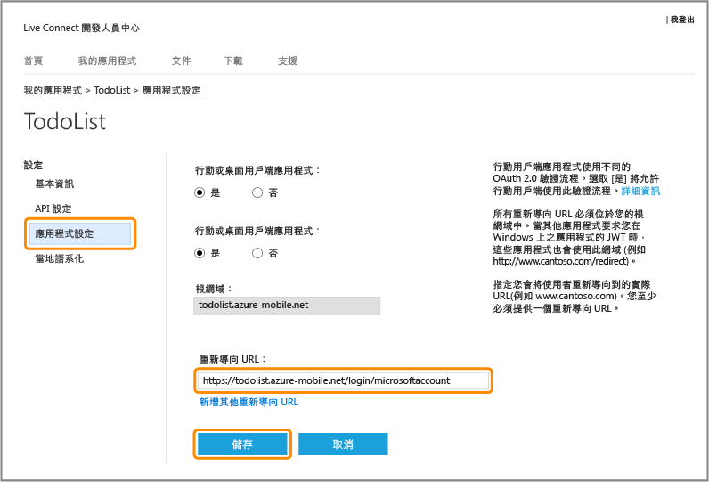
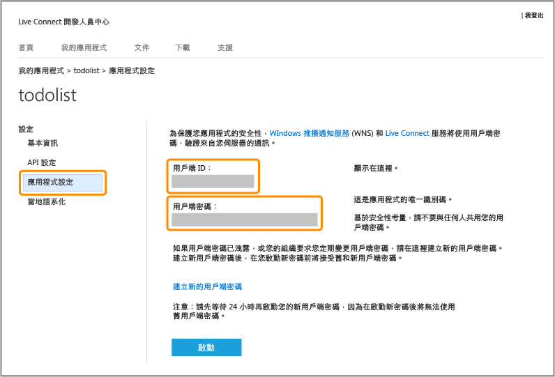

<properties 
	pageTitle="註冊 Microsoft 驗證 - 行動服務" 
	description="了解如何在 Azure Mobile Services 應用程式中註冊 Microsoft 驗證。" 
	authors="ggailey777" 
	services="mobile-services" 
	documentationCenter="Mobile" 
	manager="dwrede" 
	editor=""/>

<tags 
	ms.service="mobile-services" 
	ms.workload="mobile" 
	ms.tgt_pltfrm="NA" 
	ms.devlang="multiple" 
	ms.topic="article" 
	ms.date="06/14/2015" 
	ms.author="glenga"/>

# 註冊應用程式來使用 Microsoft 帳戶進行驗證

[AZURE.INCLUDE [mobile-services-selector-register-identity-provider](../../includes/mobile-services-selector-register-identity-provider.md)]

## 概觀 

本主題說明如何註冊行動應用程式，以使用 Microsoft 帳戶做為 Azure 行動服務的身分驗證提供者。以下步驟同時適用於使用 Live SDK 之服務導向的驗證以及用戶端導向的驗證。

##前往 Windows 開發人員中心註冊 Windows 市集應用程式

務必先在 Windows 開發人員中心註冊 Windows 市集應用程式。

>[AZURE.NOTE]Windows Phone 8、Windows Phone 8.1 Silverlight 以及非 Windows 的應用程式可跳過本節。

1. 如果您尚未註冊您的應用程式，請瀏覽至 Windows 市集應用程式之開發人員中心的[提交應用程式頁面]，使用您的 Microsoft 帳戶登入，然後按一下 **[應用程式名稱]**。

   	

2. 選取 [**保留唯一名稱來建立新應用程式**]，再按一下 [**繼續**]，然後在 [**應用程式名稱**] 中輸入應用程式的名稱，按一下 [**保留應用程式名稱**]，然後按一下 [**儲存**]。

   	

   	This creates a new Windows Store registration for your app.

3. 在 Visual Studio 中，開啟您完成[開始使用行動服務](mobile-services-dotnet-backend-windows-store-dotnet-get-started.md) (英文) 教學課程時所建立的專案。

4. 在 [方案總管] 中，以滑鼠右鍵按一下 Windows 市集應用程式專案，然後依序按一下 [市集] 和 [將應用程式與市集建立關聯...]。

  	

   	這將會顯示 **[將您的應用程式與 Windows 市集建立關聯]** 精靈。

5. 在精靈中，按一下 [**登入**]，然後以您的 Microsoft 帳戶登入，選取您在步驟 2 保留的應用程式名稱，按 [**下一步**] > [**關聯**]。

   	This adds the required Windows Store registration information to the application manifest.

6. (選擇性) 若為 Windows 通用 app，請針對 Windows Phone 市集專案重複執行步驟 4 與 5。

6. 回到新應用程式的 Windows 開發人員中心頁面，按一下 **[服務]**。

   	

7. 在 [服務] 頁面中，按一下 [Azure 行動服務] 下的 [Live Services site]。

	

您應用程式的 Microsoft 帳戶頁面會隨即顯示。

## 設定您的 Microsoft 帳戶註冊，並連結至行動服務

本節的第一個步驟只適用於 Windows Phone 8、Windows Phone 8.1 Silverlight 以及非 Windows 市集應用程式。若是上述應用程式，您也可以忽略封裝安全性識別碼 (SID)，這只有 Windows 市集應用程式可使用。

1. 若為非 Windows 市集應用程式，請瀏覽至 Microsoft 帳戶開發人員中心的<a href="http://go.microsoft.com/fwlink/p/?LinkId=262039" target="_blank">我的應用程式</a>頁面，接著以您的 Microsoft 帳戶登入 (若需要)，並按一下 [建立應用程式]，然後輸入應用程式名稱，最後按一下 [我接受]。

   	這將透過 Microsoft 帳戶為您保留應用程式名稱，並顯示您應用程式的 Microsoft 帳戶頁面。

2. 在應用程式的 Microsoft 帳戶頁面上，按一下 [API 設定]，選取啟用 [行動或桌面用戶端應用程式]，將行動服務 URL 設為 [目標網域]，在 [重新導向 URL] 中提供 `https://<mobile_service>.azure-mobile.net/login/microsoftaccount/` 的值，然後按一下 [儲存]。

	 >[AZURE.NOTE]如需使用 Visual Studio 將 .NET 後端行動服務發佈至 Azure，則重新導向 URL 是行動服務 URL 並附加路徑 _signin-microsoft_，而您的行動服務為 .NET 服務，例如 `https://todolist.azure-mobile.net/signin-microsoft`。

    

	根網域應該會自動填入。

4. 按一下 [應用程式設定]，記下 [用戶端識別碼]、[用戶端密碼] 以及 [套件 SID] 中的值。
	
   	
	
	
    > [AZURE.NOTE]用戶端密碼是重要的安全性認證。請勿將用戶端密碼與任何人分享，或與您的應用程式一起散發。只有註冊 Windows 市集應用程式才會顯示 [套件 SID] 欄位。

4. 在 [Azure 管理入口網站]中，按一下行動服務的 [身分識別] 索引標籤，輸入取自身分識別提供者的用戶端識別碼、用戶端密碼以及套件 SID，然後按一下 [儲存]。

 	
	
	>[AZURE.NOTE]若是 Windows Phone 8、Windows Phone Store 8.1 Silverlight 或非 Windows 應用程式，則不需提供套件 SID 值。
	
現在您的行動服務和應用程式都已設定成使用 Microsoft 帳戶。

<!-- Anchors. -->

<!-- Images. -->

<!-- URLs. -->

[提交應用程式頁面]: http://go.microsoft.com/fwlink/p/?LinkID=266582
[My Applications]: http://go.microsoft.com/fwlink/p/?LinkId=262039

[Azure 管理入口網站]: https://manage.windowsazure.com/
 

<!---HONumber=July15_HO2-->